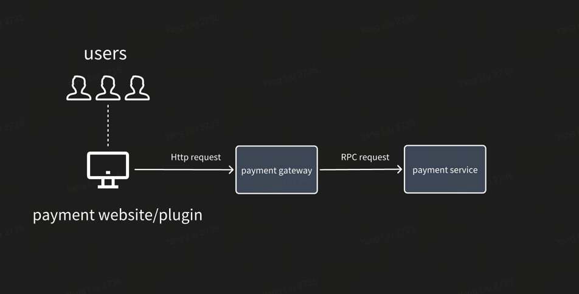
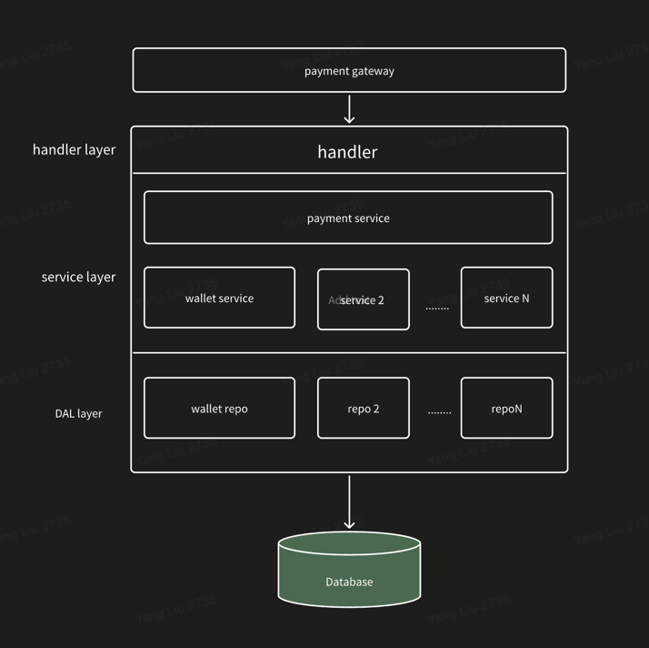
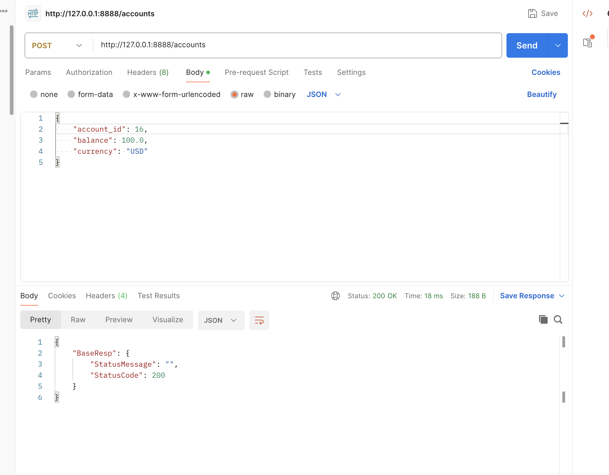
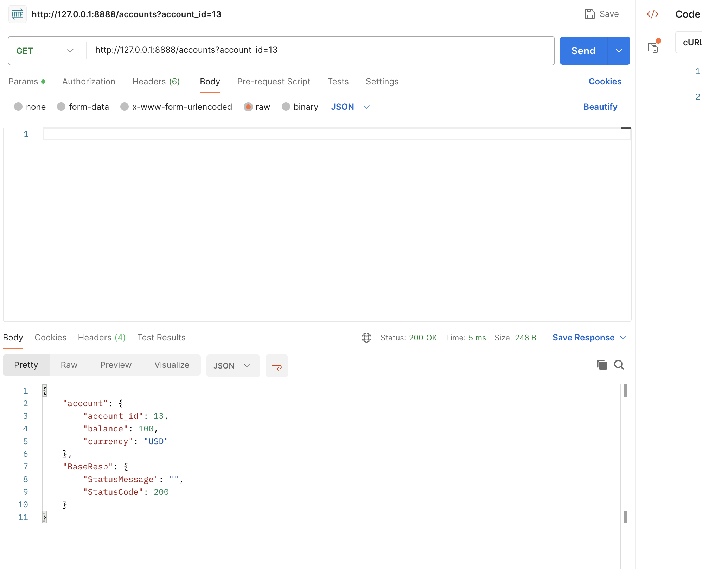
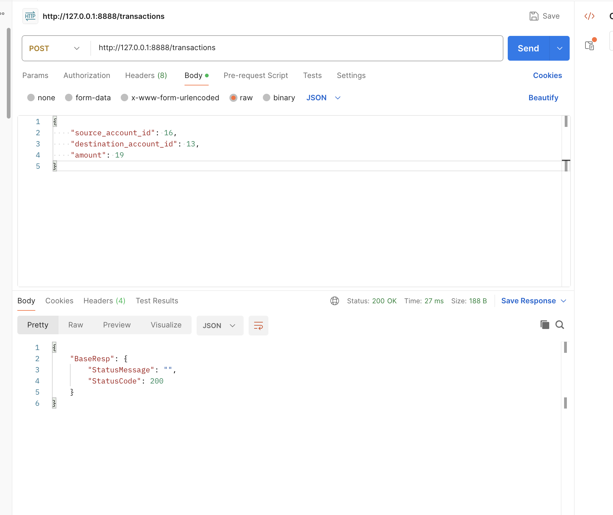
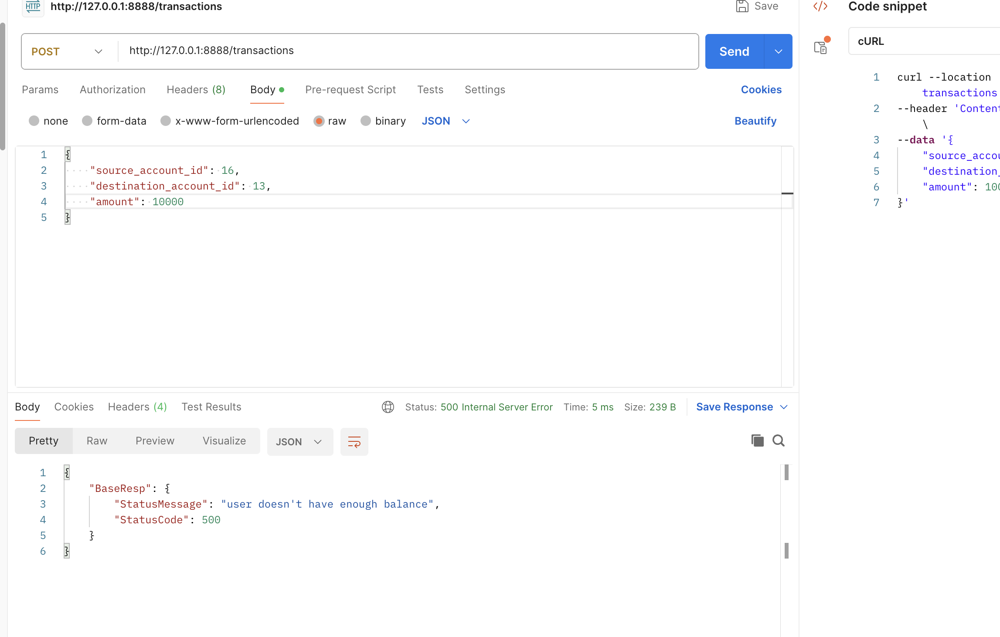

# payment system
## Intro
This is a payment system support basic function of managing wallet account and do transaction.
## Architecture
This project include 2 mircoservices:
1. payment gateway, responsible for supporting basic function like routing traffic,authN/authZ, rate-limit.
2. payment service, responsible for the core business log, manage wallet info and handle transaction.




## How to run it:
### 1. This project uses some frameworks and external tools, need to install them first
1. golang > 1.19
2. Http framework: [Hertz](https://www.cloudwego.io/docs/hertz/)
3. RPC framework: [Kitex](https://www.cloudwego.io/docs/kitex/)
4. Database golang package: [gorm](https://gorm.io/docs/index.html)
5. Database: [Mysql](https://dev.mysql.com/downloads/file/?id=488575)
### 2. create mysql database and tables at local machine 
you can reference payment_system/sql's sql
### 3. start payment system service
`
cd payment_system
./build.sh
./output/bin/acblacktea.payment_system.payment_system
`
### 4. start payment gateway service
`
cd payment_gateway
go build -o payment_gateway
./payment_gateway
`

### successful

## Api
#### 1. create account
#### http route: post http://127.0.0.1:8888/accounts
#### example
`
curl --location 'http://127.0.0.1:8888/accounts' \
--header 'Content-Type: application/json' \
--data '{
"account_id": 16,
"balance": 100.0,
"currency": "USD"
}'
`


#### 2. get account
#### http route: get http://127.0.0.1:8888/accounts
#### example
`
curl --location 'http://127.0.0.1:8888/accounts?account_id=13’
`

#### 3. Submit Transaction
#### http route: post http://127.0.0.1:8888/transaction
#### example
`
curl --location 'http://127.0.0.1:8888/transactions' \
--header 'Content-Type: application/json' \
--data '{
"source_account_id": 16,
"destination_account_id": 13,
"amount": 19
}'
`



## Database
### wallet table: save account info
```
CREATE TABLE `Wallet` (
`id` bigint(64) unsigned NOT NULL,
`balance` bigint(64) unsigned NOT NULL,
`currency` varchar(128) DEFAULT NULL,
`create_time` timestamp NOT NULL DEFAULT CURRENT_TIMESTAMP,
`update_time` timestamp NOT NULL DEFAULT CURRENT_TIMESTAMP ON UPDATE CURRENT_TIMESTAMP,
`deleted_at` timestamp NULL DEFAULT NULL,
PRIMARY KEY (`id`)
) ENGINE=InnoDB DEFAULT CHARSET=utf8mb4
`
```

### transaction table: save transaction table
```
CREATE TABLE `Transaction` (
    `id` bigint(64) unsigned NOT NULL,
    `source_account_id` bigint(64) unsigned NOT NULL,
    `destination_account_id` bigint(64) unsigned NOT NULL,
    `amount` bigint(64) unsigned NOT NULL,
    `create_time` timestamp NOT NULL DEFAULT CURRENT_TIMESTAMP,
    `update_time` timestamp NOT NULL DEFAULT CURRENT_TIMESTAMP ON UPDATE CURRENT_TIMESTAMP,
    `deleted_at` timestamp NULL DEFAULT NULL,
    PRIMARY KEY (`id`)
) ENGINE=InnoDB DEFAULT CHARSET=utf8mb4
```

## Error Message spec
| error     | Description | 
|-----------| --- |
| ErrDuplicateAccountID   | account id existed |
| ErrBalanceNotEnough | user doesn't have enough balance |
| ErrAccountIDNotExist | account is valid, not exist |
| ErrInvalidCurrency | invalid currency |
| ErrCurrencyTypeMismatch | currency type mismatch |
| ErrInvalidMoneyValue | invalid money value |
| ErrInvalidRequest | invalid request, please check |


## What can be improved later?
1. add UT, improve UT coverage. 
2. refine error message&status code
